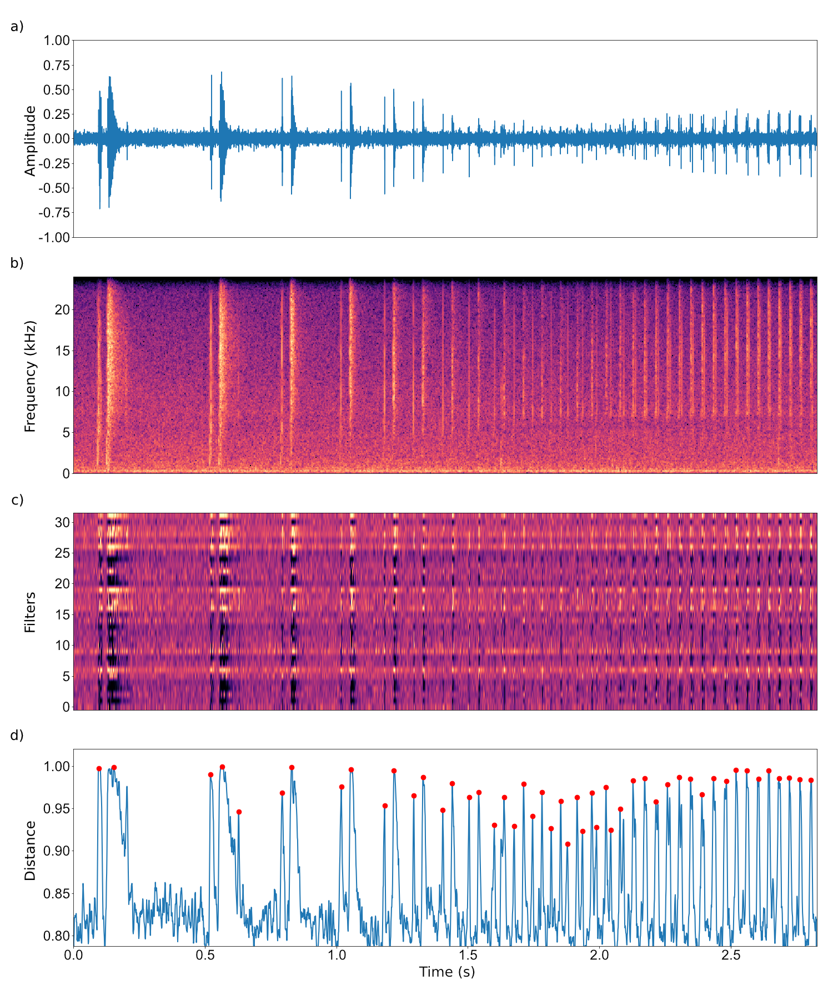

# Bioacoustic Event Detection with Self-Supervised Contrastive Learning
 
 ## Paper
 
 [Bioacoustic Event Detection with Self-Supervised Contrastive Learning](https://www.biorxiv.org/content/10.1101/2022.10.12.511740v2.full)
 
 Peter C. Bermant, Leandra Brickson, Alexander J. Titus

While deep learning has revolutionized ecological data analysis, existing strategies often rely on supervised learning, which is subject to limitations on real-world applicability. In this paper, we apply self-supervised deep learning methods to bioacoustic data to enable unsupervised detection of bioacoustic event boundaries. We propose a convolutional deep neural network that operates on the raw waveform directly and is trained in accordance with the Noise Contrastive Estimation principle, which enables the system to detect spectral changes in the input acoustic stream. The model learns a representation of the input audio sampled at low frequency that encodes information regarding dissimilarity between sequential acoustic windows. During inference, we use a peak finding algorithm to search for regions of high dissimilarity in order to identify temporal boundaries of bioacoustic events. We report results using these techniques to detect sperm whale (Physeter macrocephalus) coda clicks in real-world recordings, and we demonstrate the viability of analyzing the vocalizations of other species (e.g. Bengalese finch syllable segmentation) in addition to other data modalities (e.g. animal behavioral dynamics, embryo development and tracking). We find that the self-supervised deep representation learning-based technique outperforms established threshold-based baseline methods without requiring manual annotation of acoustic datasets. Quantitatively, our approach yields a maximal R-value and F1-score of 0.887 and 0.876, respectively, and an area under the Precision-Recall curve (PR-AUC) of 0.917, while a baseline threshold detector acting on signal energy amplitude returns a maximal R-value and F1-score of 0.620 and 0.576, respectively, and a PR-AUC of 0.571. We also compare with a threshold detector using preprocessed (e.g. denoised) acoustic input. The findings of this paper establish the validity of unsupervised bioacoustic event detection using deep neural networks and self-supervised contrastive learning as an effective alternative to conventional techniques that leverage supervised methods for signal presence indication. Providing a means for highly accurate unsupervised detection, this paper serves as an important step towards developing a fully automated system for real-time acoustic monitoring of bioacoustic signals in real-world acoustic data. 



## Usage

### Clone Repositroy

```
git clone https://github.com/colossal-compsci/SSLUnsupDet.git
cd SSLUnsupDet
```

### Setup Environment

```
pip install -r requirements.txt
```

### Data Structure

The detection training and inference pipeline assumes the data is structured as follows:

```
data
│
└───wavs
│   └─  *.wav
└───selections
    └─  *.selections.txt
```

### Configuration

Prior to training and inferencing a model, it might be necessary to modify the configuration in ```configs/config.json```. For a given dataset, it is particularly important to specify "dataset" and "model" parameters. Default "training" parameters, in general, serve as a functional baseline.

### Training

```
python train.py
```

Command-line flags are as follows:

```
-c --config name of the config JSON
-s --seed (optional) random seed
```

### Inference

```
python inference.py
```

Command-line flags are as follows:

```
-c --config name of the config JSON
-ckpt --checkpoint epoch of serialized model checkpoint 
-s --search carry out 'coarse' or 'fine' grid search mode
```

### Peak Detection

```
python peak_detect.py
```

Command-line flags are as follows:

```
-c --config name of the config JSON
-ckpt --checkpoint epoch of serialized model checkpoint 
-q --use_q bool to use uncertain (q) selection tables
-s --search carry out 'coarse' or 'fine' grid search mode
```

### Energy Amplitude-Based Peak Detection

```
python energy_detect.py
```

Command-line flags are as follows:

```
-c --config name of the config JSON
-ckpt --checkpoint epoch of serialized model checkpoint 
-q --use_q bool to use uncertain (q) selection tables
-s --search carry out 'coarse' or 'fine' grid search mode
-h --hpf implement high pass filter noise reduction
```

### Processing Results
```
python results.py
```

Command-line flags are as follows:

```
-c --config name of the config JSON
-ckpt --checkpoint epoch of serialized model checkpoint 
-q --use_q bool to use uncertain (q) selection tables
-s --search carry out 'coarse' or 'fine' grid search mode
-hpf --use_hpf implement high pass filter noise reduction
-e --compute_energy bool to compute energy amplitude-based detections
```
